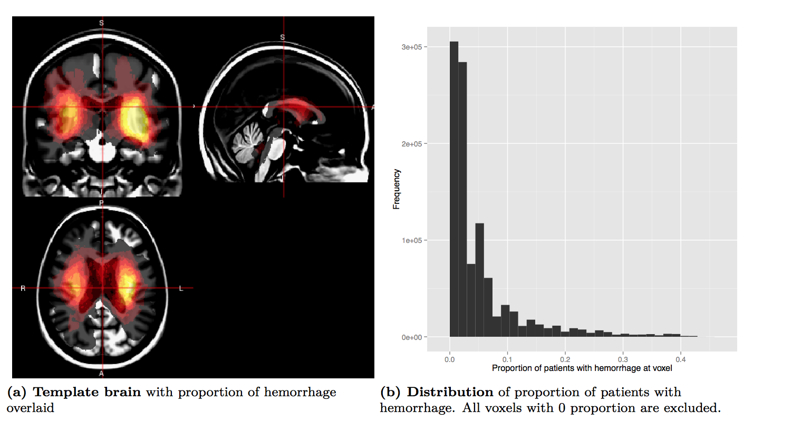

## Goals

1.  Register patient CT scans to a CT template
2.  Create a 3-dimensional (3D) density map
3.  Provide a breakdown of hemorrhage engagement of individual regions 
4.  Test if differences in location relating to a NIHSS/GCS
5.  Generate a stroke ROI that is likely to be associated with NIHSS/GCS and test its predictive performance using within-sample validation

---

## Registration of CT Scans

<!--"width:400px; height:400px;-->

---

## 3-dimensional (3D) density map
Brighter means higher percentage 

---

## Breakdown of hemorrhage engagement

* How to best display a table of results?

* We used 3 different templates: MNI, EVE-1, EVE-2

* Difference between them? 
  * MNI does not do any white matter segmentation
  * EVE-1 delineates WM into separate regions
  * EVE-2 lumps WM more in with GM

---

## Breakdown of hemorrhage engagement: MNI

MNI: Top Location: Putamen 
<TABLE border = 1, id="100-318_20070723_0957MNI">
<TR> <TH> Area </TH> <TH> MNI </TH>  </TR>
  <TR> <TD> Putamen </TD> <TD align="right"> 44.30 </TD> </TR>
  <TR> <TD> Insula </TD> <TD align="right"> 25.30 </TD> </TR>
  <TR> <TD> Uncategorized </TD> <TD align="right"> 18.50 </TD> </TR>
  <TR> <TD> Temporal Lobe </TD> <TD align="right"> 7.70 </TD> </TR>
  <TR> <TD> Thalamus </TD> <TD align="right"> 2.30 </TD> </TR>
  <TR> <TD> Frontal Lobe </TD> <TD align="right"> 1.80 </TD> </TR>
  <TR> <TD> Caudate </TD> <TD align="right"> 0.10 </TD> </TR>
   </TABLE>

---

## Breakdown of hemorrhage engagement: EVE_1

EVE_1: Top Location: PUTAMEN_left

<TABLE border = 1, id="100-318_20070723_0957EVE_1">
<TR> <TH> Area </TH> <TH> EVE_1 </TH>  </TR>
  <TR> <TD> PUTAMEN_left </TD> <TD align="right"> 22.50 </TD> </TR>
  <TR> <TD> External_capsule_left </TD> <TD align="right"> 14.90 </TD> </TR>
  <TR> <TD> Posterior_limb_of_internal_capsule_left </TD> <TD align="right"> 8.90 </TD> </TR>
  <TR> <TD> INSULAR </TD> <TD align="right"> 8.80 </TD> </TR>
  <TR> <TD> Background </TD> <TD align="right"> 7.70 </TD> </TR>
  <TR> <TD> GLOBUS_PALLIDUS_left </TD> <TD align="right"> 5.10 </TD> </TR>
  <TR> <TD> PRECENTRAL_WM_left </TD> <TD align="right"> 5.00 </TD> </TR>
  <TR> <TD> Inferior_fronto-occipital_fasciculus_left </TD> <TD align="right"> 4.10 </TD> </TR>
  <TR> <TD> Superior_corona_radiata_left </TD> <TD align="right"> 4.10 </TD> </TR>
  <TR> <TD> Retrolenticular_part_of_internal_capsule_left </TD> <TD align="right"> 4.00 </TD> </TR>
  <TR> <TD> Fornix(cres)_Stria_terminalis_left </TD> <TD align="right"> 2.60 </TD> </TR>
  <TR> <TD> PRECENTRAL_GYRUS_left </TD> <TD align="right"> 2.50 </TD> </TR>
  <TR> <TD> SUPERIOR_TEMPORAL_GYRUS </TD> <TD align="right"> 2.20 </TD> </TR>
  <TR> <TD> INFERIOR_FRONTAL_WM_left </TD> <TD align="right"> 2.10 </TD> </TR>
  <TR> <TD> Anterior_limb_of_internal_capsule_left </TD> <TD align="right"> 1.30 </TD> </TR>
  <TR> <TD> Sagittal_stratum_left </TD> <TD align="right"> 1.10 </TD> </TR>
  <TR> <TD> Uncinate_fasciculus_left </TD> <TD align="right"> 0.70 </TD> </TR>
  <TR> <TD> INFERIOR_TEMPORAL_WM_left </TD> <TD align="right"> 0.40 </TD> </TR>
  <TR> <TD> POSTCENTRAL_GYRUS_left </TD> <TD align="right"> 0.40 </TD> </TR>
  <TR> <TD> Cerebral_peduncle_left </TD> <TD align="right"> 0.30 </TD> </TR>
  <TR> <TD> INFERIOR_FRONTAL_GYRUS_left </TD> <TD align="right"> 0.30 </TD> </TR>
  <TR> <TD> INFERIOR_TEMPORAL_GYRUS </TD> <TD align="right"> 0.30 </TD> </TR>
  <TR> <TD> POSTCENTRAL_WM_left </TD> <TD align="right"> 0.30 </TD> </TR>
  <TR> <TD> SUPERIOR_TEMPORAL_WM_left </TD> <TD align="right"> 0.30 </TD> </TR>
   </TABLE>

---

## Test if differences in location
For NIHSS:

---

## Test if differences in location
For GCS:

---

## ROI
ROI for GCS, top 2000 p-values:

---

## ROI
ROI for GCS, top 22858 p-values:

---

## ROI Prediction

---

## Validation

* 111 patients to 3 readers

* 22 patients randomly selected twice (each reader got the same duplicates)

* Send the images (NIfTI) and the images that were registered to template

* CT Scoring (Natalie)

---

